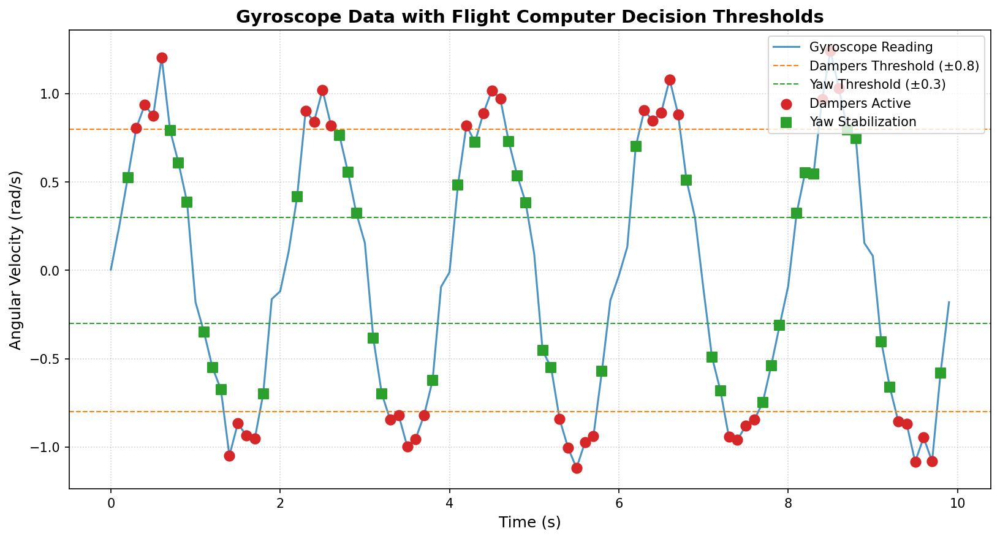

# 🚀 Spacecraft_HIL_Simulation

A real-time Hardware-in-the-Loop (HIL) simulation for spacecraft avionics — built in Python.  
This project simulates a gyroscope sensor and a basic flight computer, allowing real-time interaction to modify signal parameters mid-simulation.

---

## 📌 Features

- Simulates gyroscope sensor with sine + Gaussian noise  
- Real-time interactive control: `pause`, `resume`, `stop`, and change signal parameters  
- Decision logic to simulate basic flight computer actions  
- Outputs:
  - Time-series plot of gyroscope data with control thresholds  
  - Command log file  

---

## 🧠 How It Works

1. **Sensor model** generates a noisy sine-wave signal as gyroscope output.  
2. **Flight computer** analyzes the signal and makes decisions like:
   - `Activate Dampers`
   - `Stabilize Yaw`
   - `Hold Position`  
3. You can interact with the simulation in real time via terminal input:
   - `pause`, `resume`, `stop`
   - `amp <value>`, `freq <value>`, `noise <value>`

---

## 🖥️ Requirements

- Python 3.x  
- `numpy`  
- `matplotlib`  

Install required libraries:

```bash
pip install numpy matplotlib
```

---

## ▶️ Run the Simulation

```bash
python hil_simulation.py
```

During simulation, you can type:

- `pause` — Pauses simulation  
- `resume` — Resumes simulation  
- `stop` — Ends simulation  
- `amp 1.5` — Set signal amplitude  
- `freq 0.8` — Set signal frequency  
- `noise 0.2` — Set noise standard deviation  

---

## 📈 Sample Output



---

## 📂 Output Files

- `gyro_data_interactive.png` — Plot of gyroscope readings vs. time  
- `hil_simulation_log.txt` — Logged commands and readings in CSV format  

---

## 📁 Project Structure

```
Spacecraft_HIL_Simulation/
├── hil_simulation.py           # Main simulation file
├── README.md                   # This file
├── gyro_data_interactive.png   # Output plot (auto-generated)
└── hil_simulation_log.txt      # Output log (auto-generated)
```

---

## 🛠️ Future Ideas

- Add GUI using Streamlit or Tkinter  
- Simulate more sensors (e.g., accelerometers, magnetometers)  
- Integrate with real spacecraft hardware for testing  

---

## 👨‍💻 Author

Arhaan Khan

---

## 📝 License

This project is licensed under the MIT License.

---

> Made with 💡 for simulation testing, space systems learning, and real-time control exploration.
